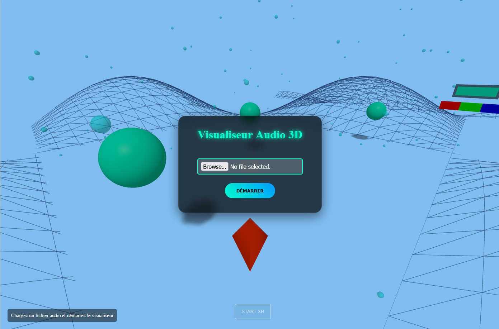
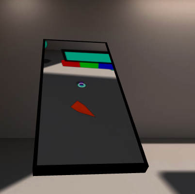

# Mini Application Web AR - THREE.js + WebXR

## Installation et Lancement local

Pour récupérer et lancer le projet localement :

1. **Cloner le projet** :
   ```bash
   git clone git@github.com:ChocoIsChoco/ProjectWebGL.git
   cd ProjectWebGL
   ```

2. **Installer les dépendances** :
   ```bash
   npm install
   ```

3. **Lancer en mode développement** :
   ```bash
   npm run dev
   ```

## Déploiement
Le projet est automatiquement déployé sur **Render** à partir de la branche **`ar`**.

## Lien de test en direct
**Testez l'application ici : [https://visualiseur-audio.onrender.com](https://visualiseur-audio.onrender.com)**  
*(Note : Testé avec succès sur **Firefox**)*

## Illustrations du projet



## Sources d'inspiration
Vous trouverez tous les liens et documentations utilisés pour ce projet dans le fichier **[SOURCES.md](./SOURCES.md)**.
